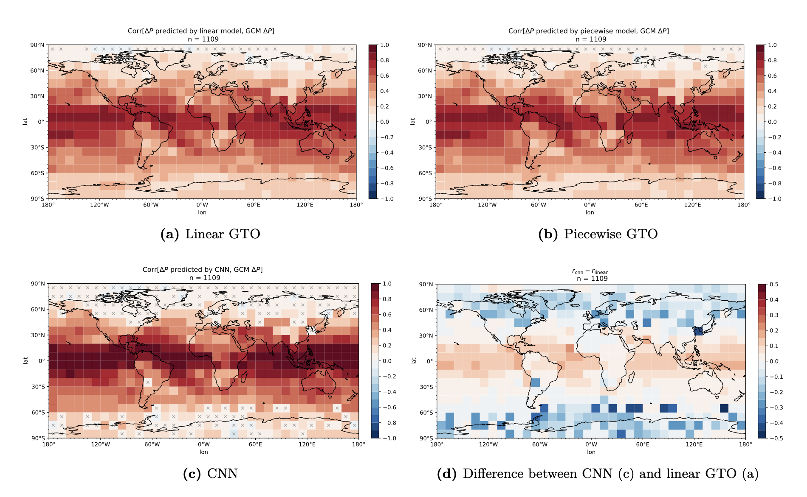

# MPhys Project

This is a repository for my masters project at the University of Oxford, "Predicting regional precipitation response to regional sea surface temperature anomalies". It is rather messy as it contains most of the code I used to carry out the project. I am grateful towards my supervisors, Andrew Williams and Dr. Duncan Watson-Parris, for their time and help. 

Feel free to read my project report, ```JW_MPhys_report_Jun_12.pdf```, to learn more about the project.



Due to file size and data access restrictions, much of the raw data is not included here.
